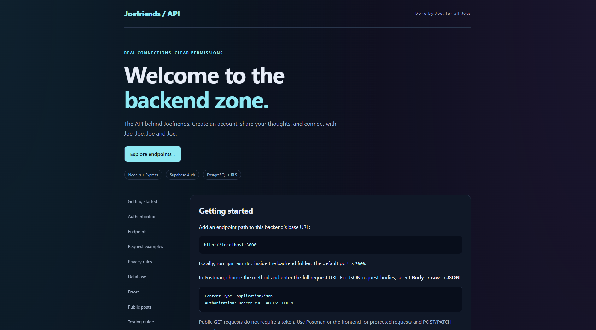

# Joefriends API

Joefriends is an authenticated social media API built for Joes. Users can register, log in, create public or friends-only
posts, and send and accept friend requests.

## Technology

- Node.js and Express
- Supabase Auth
- PostgreSQL
- React and Vite 

## Links

- Backend and API documentation: TODO — add Vercel backend URL
- Frontend: TODO — add frontend URL
- Frontend repository: TODO — add GitHub URL

The backend homepage contains full API documentation, request examples,
privacy rules, error responses, and a public-posts preview.

## API endpoints

| Method | Endpoint | Purpose | Token |
| --- | --- | --- | --- |
| GET | `/` | Documentation homepage | No |
| POST | `/signup` | Register an account | No |
| POST | `/login` | Log in and receive a token | No |
| GET | `/profile` | View current user ID and welcome message | Required |
| GET | `/users` | List other users | Required |
| GET | `/posts` | Read permitted posts | Optional |
| POST | `/posts` | Create a post | Required |
| GET | `/friends` | List own friendship records | Required |
| POST | `/friends` | Send a friend request | Required |
| PATCH | `/friends/:id/accept` | Accept an incoming request | Recipient |

## Authorization

- Public posts are accessible to everyone through the API.
- Friends-only posts are visible to the author and accepted friends.
- Pending requests do not grant access to friends-only posts.
- Only the recipient can accept a pending friend request.
- Self-friend requests and duplicate friendship pairs are rejected.
- Foreign keys connect posts and friendships to user profiles.

## Author

Lim Joe Onn — A Joefriend.
